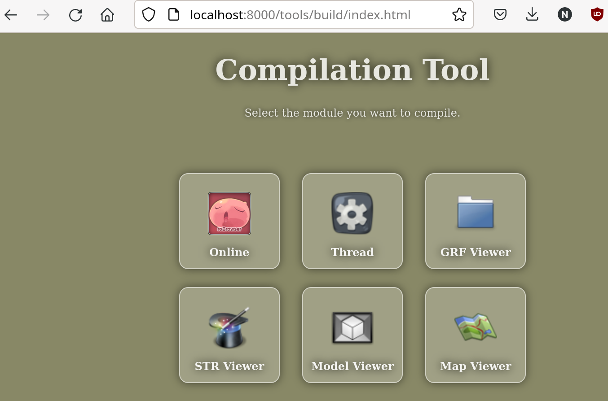

# Getting started

## Important notes before starting
- **In case of any error start by opening developer mode and check the browser `Console` (`F12` or `CTRL+Shift+I` in most browsers). Don't forget to adjust the level filters if you don't see everything. Also worth checking the `Network` tab.**
- **For public servers using secure web protocols `https` and `wss` is a de-facto must, since most browsers don't allow non-secure websocket calls on the internet anymore.**

## Local testing
This guide section help you running robrowser locally.
### Prerequisite
#### RoBrowser
- install websocket proxy `npm install wsproxy -g`
- Run http server at root of Ragna.roBrowser directory (use any of [one liner http server](https://gist.github.com/willurd/5720255))

- You own a full client
#### Game Server
- Client/packet versions currently supported up to `2015-10-01`. We advise to use versions older than `2014`.
- Disable pincode on the game server. (Not supported yet)
- Disable packet_obfuscation on the game server. (Not supported yet, causes invalid packets)

We assume in guide below http server to run on port `8000`.
### Compile files
This step/section is only recommended for a "Live" server. It will only pack all the resource files into one file to speed up loading. Requires to set in the roBrowser config: `development: false,`.

For development purposes (modifying the source/testing) skip this section and set in the roBrowser config: `development: true,`. In development mode roBrowser will use the files directly from `src/`.
- Access `http://localhost:8000/tools/build/index.html` with your browser
  
- click on "Online", compilation should take around 10~30secs. If it runs longer than 2 minutes there might be an issue.
- click on "Thread"
- place `Online.js`and `ThreadEventHandler.js` files under Ragna.roBrowser `root` directory

### Add game assets
- copy your `.grf` under `client/resources` directory
- copy your `DATA.INI` (GRF loading order) under `client/resources` directory
- copy your BGM `.mp3` under `client/BGM` directory
- copy your data directory under `client/data`directory
- copy your `clientinfo.xml` (client-server information) under `client/data` directory
- copy your AI files under `AI` directory
- check the `client/configs.php` if it is configured properly for your use

In all `AI/*.lua` files :
- Replace all `require "AI\\Const"` with `dofile "./AI/Const.lua"`
- Replace all `require "AI\\Util"` with `dofile "./AI/Util.lua"`

### Plugins
- copy your custom plugins into `src\Plugins` 

Some examples: https://github.com/MrAntares/Ragna.roBrowser-plugins

### Configure ROBrowser
- edit `examples/api-online-frame.html`
```js
function initialize() {
      var ROConfig = {
          target:        document.getElementById("robrowser"),
          type:          ROBrowser.TYPE.FRAME,
          application:   ROBrowser.APP.ONLINE,
          width:          800,
          height:         600,
          development:    false,
          servers: [{
              display:     "Demo Server",
              desc:        "roBrowser's demo server",
              address:     "127.0.0.1",
              port:        6900,
              version:     25,
              langtype:    12,
              packetver:   20191223,
              packetKeys:  false,
              socketProxy: "ws://127.0.0.1:5999/",
              adminList:   [2000000]
          }],
          skipServerList:  true,
          skipIntro:       false,
          
          /*OPTIONAL/CUSTOM CONFIGS*/
          plugins:  {
                        PluginName: 'Plugin_JS_Path_In_PluginsFolder_Without_Extension',
                        /*Example:*/
                        KeyToMove: 'KeyToMove/KeyToMove',
                    },
          ThirdPersonCamera: true,
          FirstPersonCamera: true,
      };
      var RO = new ROBrowser(ROConfig);
      RO.start();
  }
  window.addEventListener("load", initialize, false);
```
(Or you can set up your own `index.html` based on the examples)

### Start websocket proxy
- run `wsproxy -a 127.0.0.1:6900,127.0.0.1:6121,127.0.0.1:5121`
also don't forget to start your server

Note: Most of the browsers nowadays don't support mixed security, so either use `https` & `wss` everywhere or `http` & `ws`. Some browsers recently started to disable non-secure websocket calls, so `https` & `wss` is highly recommended if you are using roBrowser on a non-local/open server.
### Enjoy!
- Access to `http://localhost:8000/examples/api-online-frame.html` with your browser
- 


## Troubleshooting
### Screen is blank
Check that you don't have an extension using [postMessage](https://developer.mozilla.org/en-US/docs/Web/API/Window/message_event), it will conflict with code in `api.html` which listen for message.

### AI%5cConst.js(404 not found)


You probably forgot the step about `AI` `require` replacement in `Add game assets` section

### ....(403 not found) ... 403 (Forbidden)

You probably have a server secutiry issue if your server is public. Check your certificates and make sure you configured everything to run securely, you provided the required configuration values in `https`/`wss` and that the main page of roBrowser is also opened with `https`. Redirecting every `http` call to `https` on the webserver is also probably a good idea.

### Other
I personally had to disable `metamask` extension.
